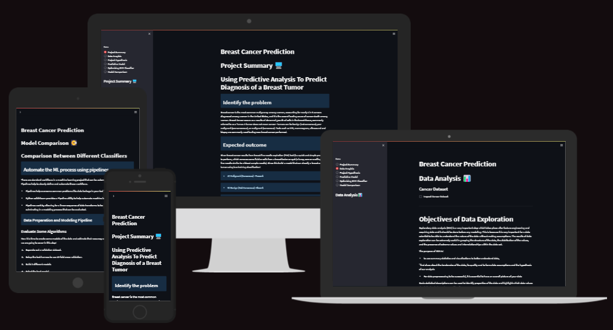

The dashboard for [Breast Cancer model is hosted on Heroku](https://breast-cancer-prediction.herokuapp.com/)

1.	[Introduction](#Introduction)
2.  [Dataset Content](#dataset-content)
3.	[Business Requirements](#business-requirements)
    *	[Epics](#epics)
    *	[User Stories](#user-stoires)
4.	[Hypotheses and validation](#hypothesis-and-how-to-validate)
5.	[Rationale to map the business requirements to the Data Visualizations and ML tasks](#the-rationale-to-map-the-business-requirements-to-the-data-visualizations-and-ml-tasks)
6.	[ML Business Case](#ml-business-case)
7.	[Dashboard Design](#dashboard-design)
    *	[Page 1: Quick project summary](#page-1-quick-project-summary)
    *	[Page 2: Data Anaylsis Page](#page-2-data-visualization)
    *	[Page 3: Project Hypothesis](#page-3-hypothesis)
    *	[Page 4: Predictive Model](#page-4-predictive-model)
    *	[Page 5: Optimizing SVM Classifier](#page-5-optimizing-classifier)
    *	[Page 6: Model Comparison](#page-6-model-comparisonconculsion)
8.  [Unfixed Bugs](#unfixed-bugs)
9.  [Testing](#testing)
10.	[Deployment](#deployment)
11.	[Main Data Analysis and Machine Learning Libraries](#main-data-analysis-and-machine-learning-libraries)
12.	[Credits](#credits)

## Introduction

### Identify the problem
Breast cancer is the most common malignancy among women, accounting for nearly 1 in 3 cancers diagnosed among women in the United States, and it is the second leading cause of cancer death among women. Breast Cancer occurs as a results of abnormal growth of cells in the breast tissue, commonly referred to as a Tumor. A tumor does not mean cancer - tumors can be benign (not cancerous), pre-malignant (pre-cancerous), or malignant (cancerous). Tests such as MRI, mammogram, ultrasound and biopsy are commonly used to diagnose breast cancer performed.

### Expected outcome
Given breast cancer results from breast fine needle aspiration (FNA) test (is a quick and simple procedure to perform, which removes some fluid or cells from a breast lesion or cyst (a lump, sore or swelling) with a fine needle similar to a blood sample needle). Since this build a model that can classify a breast cancer tumor using two training classification:
* 1= Malignant (Cancerous) - Present
* 0= Benign (Not Cancerous) -Absent

### Objective 
Since the labels in the data are discrete, the predication falls into two categories, (i.e. Malignant or benign). In machine learning this is a classification problem. 
        
> *Thus, the goal is to classify whether the breast cancer is benign or malignant and predict the recurrence and non-recurrence of malignant cases after a certain period.  To achieve this we have used machine learning classification methods to fit a function that can predict the discrete class of new input.*

## Dataset Content

* The dataset is on kaggel it is publicly available so it does not require a license to use, the data set contain 569 rows and 32 columns. Each row represents and person and the columns have differant signs or textures of tumours. The dataset contains **569 samples of malignant and benign tumor cells**. 
* The first two columns in the dataset store the unique ID numbers of the samples and the corresponding diagnosis (M=malignant, B=benign), respectively. 
* The columns 3-32 contain 30 real-value features that have been computed from digitized images of the cell nuclei, which can be used to build a model to predict whether a tumor is benign or malignant. 

Data Types
Structured data is data which is a form of data which has a high degree or organization such as numerical or categorical data. Temperature, phone numbers, gender are examples of structured data.

Unstructured data is data in a form which doesn’t explicitly have structure we are used to. Examples of unstructured data are photos, images, audio, language text and many others. There is an emerging field called Deep Learning which is using a specialized set of algorithms which perform well with unstructured data.

The two common types of structured we commonly deal with are categorical variables (which have a finite set of values) or numerical values (which are continuous).

Categorical Variables: Categorical variables can also be nominal or ordinal.

* Nominal data has no intrinsic ordering to the categories. For example gender (Male, Female, Other) has no specific ordering.

* Ordinal data as clear ordering such as three settings on a toaster (high medium and low). A frequency table (count of each category) is the common statistic for describing categorical data of each variable, and a bar chart or a waffle chart (shown below) are two visualizations which can be used.

Numeric Variables: Numeric or continuous variables can be any value within a finite or infinite interval (temperature, height, weight.

There are two types of numeric variables are interval and ratios:

*	Interval variables have numeric scales and the same interpretation throughout the scale, but do not have an absolute zero. eg temperature in Fahrenheit or Celcius can meaningfully be subtracted or added (difference between 10 degrees and 20 degrees is the same difference as 40 to 50 degrees) but cannot be multiplied. For example, a day which is twice as hot may not be twice the temperature
*	ratio scale of measurement is the most informative scale. It is an interval scale with the additional property that its zero position indicates the absence of the quantity being measured.

Transforming Data: There are a couple of techniques:

*	Binning (Numerical to Categorical) -Binning
*	Encoding (Categorical to Numerical); Continuization
*	Encoding or continuation is the transformation of categorical variables to binary or numerical counterparts. An example is to treat male or female for gender as 1 or 0. Categorical variables must be encoded in many modeling methods (e.g., linear regression, SVM, neural networks)
*	Two main types of encoding are Binary and Target-based (<http://www.saedsayad.com/encoding.htm>)
*	Binary encoding is a special case of encoding where the value is set to a 0 or 1 to indicate absence or presence of a category.
*	One hot encoding is a special case where multiple categories are each binary encoded. Given we have k categories, this will create k extra features (thus increasing the dimensionality of the data)

## Business Requirements

Business Requirement 1

*	The client is interested conducting a study to differentiate weather a tumor is benign or malignant.
*   As a client, I can navigate easily around an interactive dashboard so that I can view and understand the data presented and I can view and toggle visual graphs, charts of the data.

Business Requirement 2

*   As a client, I can access and see the proccess used in developing the machince learning model with access given to the finalized model.
*	The client is interested in predicting whether a given tumour is malignant or benign based on the given features, with a high degree of accuracy.

In order to address the business requirements, we have the following epics and user stories. Each user story was then broken down to manageable stasks, and the agile process was used to implement each task.

### Epics

*   Information gathering and data collection.
*   Data visualization, cleaning, and preparation.
*   Model training, optimization and validation.
*   Dashboard planning, designing, and development.
*   Dashboard deployment and release.

### User Stoires

* US1: As a client, I want to know which attributes will help to differentiate weather a tumor is benign or malignant on the the right set of features.
    
* US2: As a client, I want to have reliable prediction weather a tumor is bengin or maglignant helping to get the person the correct treament as quickly as possiable.

* US3: As a technical user, I want to learn about the ML steps that were used to arrive at the best prediction so that I can understand the model employed.
    
* US4: As a technical user, I want to know the model performance so that I can ensure that the predictions are reliable. 
    
* US5: As a client, I want to get a dashboard so that I can display the results of the prediction on a standalone app.
    
* US6: As a user, I want to have access to the data cleaning and preparation pipeline so that I can quickly detemine if the tumor is maglingant or begnian without reinventing the wheel.
    
* US7: As a user, I want to know the source and content of the data used in training the model so that I can be confident about the quality of the trained model.
    
* US8: As a user, I want to know the project hypotheses and how they were validated so that I get a deeper understand of the mechanisms that determine if a tumor is maglignant or begnian.

## Hypothesis and how to validate?

* We believe that by looking at different features we can with a good degree of accuracy differentiate between benign or malignant tumours. For this model, we would need the accuracy to be above 90% as stated in the business requirements.

* This analysis aims to observe which features are most helpful in predicting malignant or benign cancer and to see general trends that may aid us in model selection and hyperparameter selection. The goal is to classify whether the breast cancer is benign or malignant. To achieve this, I have used machine learning classification methods to fit a function that can predict the discrete class of new input.

* This hypothesis will be validated through the testing and graphical evaluation of the generated model, specifically logging its validation accuracy and loss between epochs, as well as creating a confusion matrix between the two outcomes.

* If these two hypotheses are validated, the client can use the insights offered by conventional data analysis to aid in getting a diagonisis quickly and with a high degree of accuracy.

## The rationale to map the business requirements to the Data Visualizations and ML tasks

Business Requirement 1: Data Visualizations
1. Data Exploration 
2. Categorical Data
3. Feature Scaling
The [NB2 Exploratory Data Analysis](/workspaces/Breast-Cancer-Prediction/jupyter_notebooks/NB2_ExploratoryDataAnalysis.ipynb) and [NB3 Data Preprocesing](/workspaces/Breast-Cancer-Prediction/jupyter_notebooks/NB3_DataPreprocesing.ipynb) notebooks handles this business requirement.

Business Requirement 2: Machine Learing Classification Analysis
1. Model Selection
2. Finalize Model
3. Test Model
4. Conclusion
The [NB5 Optimizing SVM Classifier](/workspaces/Breast-Cancer-Prediction/jupyter_notebooks/NB5_OptimizingSVMClassifier.ipynb) and [NB6 Comparison between different classifiers](/workspaces/Breast-Cancer-Prediction/jupyter_notebooks/NB6_Comparison_between_different_classifiers.ipynb) notebooks handles this business requirement.

## ML Business Case

This analysis aims to observe which features are most helpful in predicting malignant or benign cancer and to see general trends that may aid us in model selection and hyper parameter selection. The goal is to classify whether the breast cancer is benign or malignant. To achieve this i have used machine learning classification methods to fit a function that can predict the discrete class of new input. 
In our dataset we have the outcome variable or Dependent variable i.e Y having only two set of values, either M (Malign) or B(Benign). So we will use Classification algorithm of supervised learning.

We have different types of classification algorithms we will be using :-
1. Logistic Regression
2. Nearest Neighbor
3. Support Vector Machines
4. Decision Tree Algorithm
5. Random Forest Classification
We will use sklearn library to import all the methods of classification algorithms.
We will use LogisticRegression method of model selection to use Logistic Regression Algorithm.

The model success metrics are 90% or above on the test set.

We will use the CRISP-DM process to work though this and complete all requiements required by the client. The image below will show the CRISP-DM process

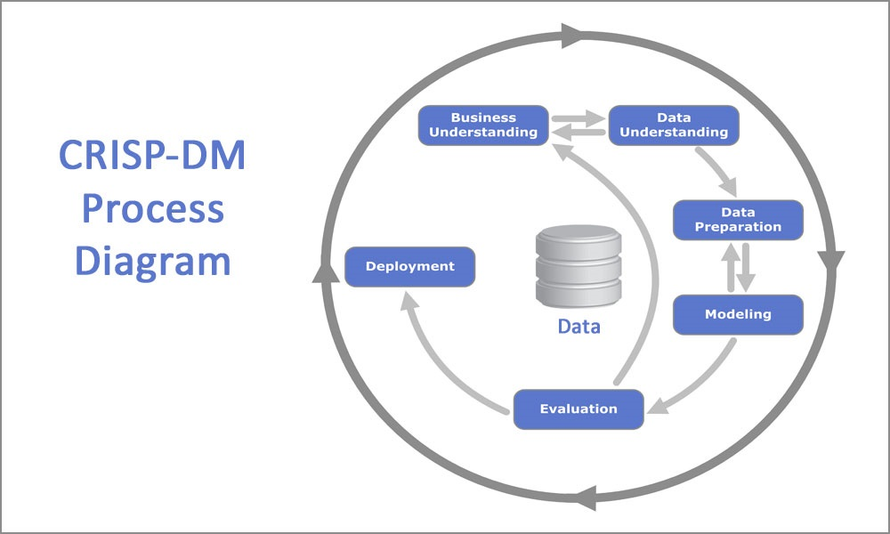

[NB1 Identify Problem + Clean Data](/workspaces/Breast-Cancer-Prediction/jupyter_notebooks/NB1_IdentifyProblem+DataClean.ipynb) This notebook shows the business understanding and data understanding parts of the CRISP-DM process.

[NB2 Exploratory Data Analysis](/workspaces/Breast-Cancer-Prediction/jupyter_notebooks/NB2_ExploratoryDataAnalysis.ipynb) This notebook shows the data understanding and data preparation parts of the CRISP-DM process

[NB3 Data PreProcesing](/workspaces/Breast-Cancer-Prediction/jupyter_notebooks/NB3_DataPreprocesing.ipynb) This notebook shows the data preparation part of the CRISP-DM process

[NB4 Predictive Model Using SVM](/workspaces/Breast-Cancer-Prediction/jupyter_notebooks/NB4_PredictiveModelUsingSVM.ipynb) This notebook shows the Modeling part of the CRISP-DM process

[NB5 Optimizing SVM Classifier](/workspaces/Breast-Cancer-Prediction/jupyter_notebooks/NB5_OptimizingSVMClassifier.ipynb)This notebook shows the Modeling and evalution parts of the CRISP-DM process

[NB6 Comparison Between Different Classifiers](/workspaces/Breast-Cancer-Prediction/jupyter_notebooks/NB6_Comparison_between_different_classifiers.ipynb) This notebook shows the Evaluation part of the CRISP-DM process

The final part of the process is the deployment the process to deploy is shown in the deployment section of this file and can be veiwed in the finished streamlit application [Breast Cancer model is hosted on Heroku](https://breast-cancer-prediction.herokuapp.com/)

## Dashboard Design

### Page 1: Quick project summary
* Quick project summary
* Describe Project Dataset
* State Business Requirements
A introdution to the project with the goals in the form of bussiness requirements, a decribsion on the dataset explaining were i got the data and also be able to view the data. The business requirements will be stated so we know what we are lookng to create.

### Page 2: Data Visualization
* Data Exploration
* Categorical Data
* Feature Scaling
Explore the variables to assess how they relate to the response variable In this notebook, we'll get familiar with the data using data exploration and visualization techniques using python libraries (Pandas, matplotlib, seaborn. Familiarity with the data is important which will provide useful knowledge for data pre-processing). Find the most predictive features of the data and filter it so it will enhance the predictive power of the analytics model. We'll use feature selection to reduce high-dimension data, feature extraction and transformation for dimensionality reduction. This is essential in preparing the data before predictive models are developed.

### Page 3: Hypothesis
* Project Hypothesis
* Expected outcome
Show the project hypothesis and explain how we can validate this.

### Page 4: Predictive Model
* Model Selection
* Test Model
Construct predictive models to predict the diagnosis of a breast tumor. We'll construct a predictive model using SVM machine learning algorithm to predict the diagnosis of a breast tumor. The diagnosis of a breast tumor is a binary variable (benign or malignant). we'll also evaluate the model using confusion matrix the receiver operating curves (ROC), which are essential in assessing and interpreting the fitted model.

### Page 5 Optimizing Classifier
* Optimizing the SVM Classifier
* Grid Search Parameter Tuning
* Random Search Parameter Tuning
Construct predictive models to predict the diagnosis of a breast tumor. We'll aim to tune parameters of the SVM Classification model using scikit-learn.

### Page 6: Model Comparison/Conculsion
* Evaluate Algorithms
* Tuning Hyper-Parameters
* Finalize Model
* Conclusion
There are standard workflows in a machine learning project that can be automated. In Python scikit-learn, Pipelines help to clearly define and automate these workflows.Pipelines help overcome common problems like data leakage in your test harness. Python scikit-learn provides a Pipeline utility to help automate machine learning workflows.Pipelines work by allowing for a linear sequence of data transforms to be chained together culminating in a modeling process that can be evaluated.
  
## Unfixed Bugs
* There were no known unfixed bugs in this project.

## Testing

### Code Validation

All of the Python code in this project was validated as conforming to PEP8 standards via installation of the pycodestyle package in the workspace terminal via pip install pycodestyle

For the cells of the Jupyter notebooks, an additional step was required of temporarily adding two code cells atop each notebook containing the following code: %load_ext pycodestyle_magic and %pycodestyle_on .

I subsequently reran the cells and edited them according to the errors that were documented there.

For the Streamlit app pages and source code files, I simply edited the code until no errors were recorded in the Problems section of the GitPod workspace.

## Deployment
### Heroku

* The App live link is: https://YOUR_APP_NAME.herokuapp.com/ 
* Set the runtime.txt Python version to a [Heroku-20](https://devcenter.heroku.com/articles/python-support#supported-runtimes) stack currently supported version.
* The project was deployed to Heroku using the following steps.

1. Log in to Heroku and create an App

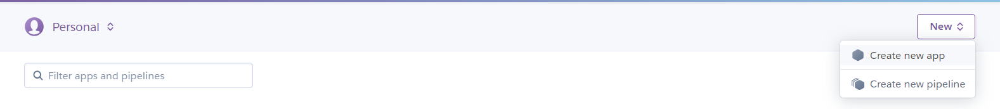

2. Create a Name for the Applipcation

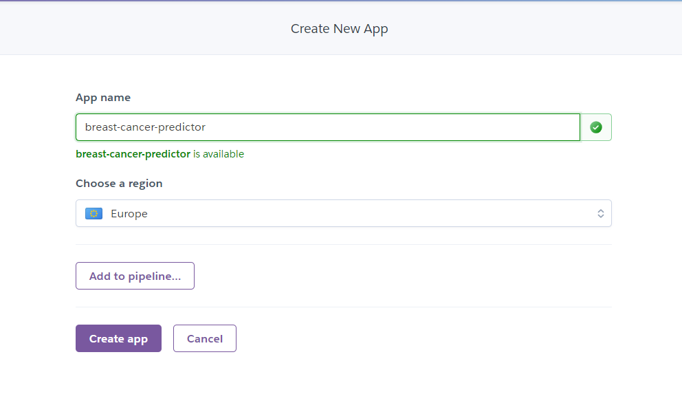

3. At the Deploy tab, select GitHub as the deployment method.

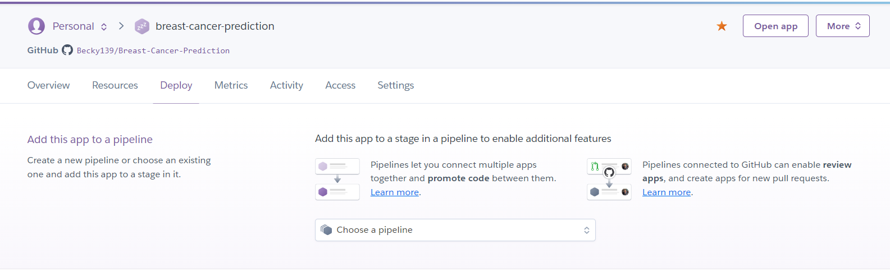

4. Select your repository name and click Search. Once it is found, click Connect.

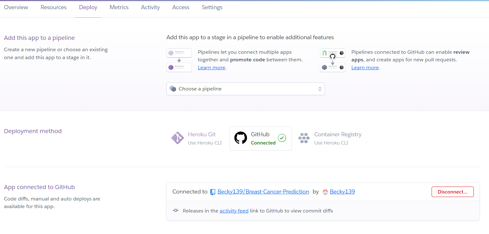

5. If the slug size is too large then add large files not required for the app to the .slugignore file.

6. To Convert the stack from stack-22 to stack-20 so we can deploy the app Login to heroku in command line

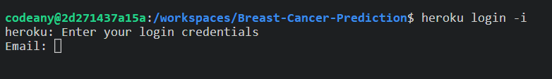

7. Copy API key from heroku enter email as username and then use API key as password

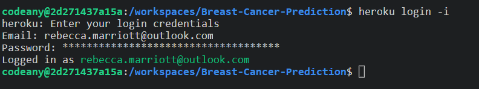

8. Enter the following command to convert the stack so its compatiable with current version

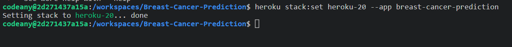

9. Select the branch you want to deploy, then click Deploy Branch.

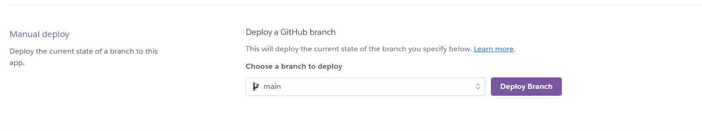

10. The deployment process should happen smoothly if all deployment files are fully functional. Click now the button Open App on the top of the page to access your App.

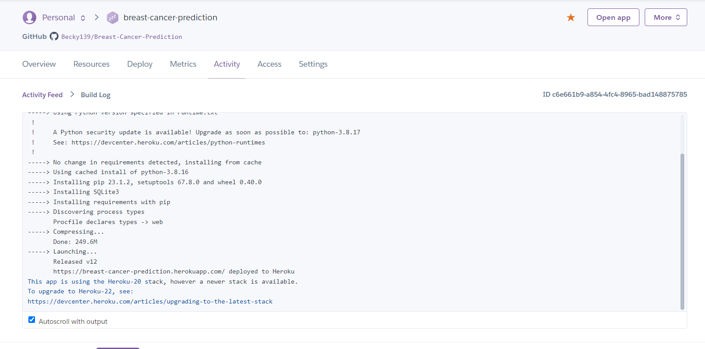

## Gitpod Reminders

To log into the Heroku toolbelt CLI:

1. Log in to your Heroku account and go to *Account Settings* in the menu under your avatar.
2. Scroll down to the *API Key* and click *Reveal*
3. Copy the key
4. In Gitpod, from the terminal, run `heroku_config`
5. Paste in your API key when asked

You can now use the `heroku` CLI program - try running `heroku apps` to confirm it works. This API key is unique and private to you so do not share it. If you accidentally make it public then you can create a new one with *Regenerate API Key*.

## Main Data Analysis and Machine Learning Libraries

* NumPy - Processing of images via conversion to NumPy arrays. Many other libraries used in this project are also dependent on NumPy
* Pandas - Conversion of numerical data into DataFrames to facilitate functional operations
* Matplotlib - Reading, processing, and displaying image data, producing graphs of tabular data
* Seaborn - Data visualisation and presentation, such as the confusion matrix heatmap and image dimensions scatter plot.
* Plotly - Graphical visualisation of data, used in particular on dashboard for interactive charts
* Scikit-learn - Calculating class weights to handle target imbalance and generating classification report
* Scikit-image - Application of Sobel filters to image averages to detect edges and dominant features
* Scipy - It provides more utility functions for optimization, stats and signal processing

### Other technologies used

Streamlit - Development of dashboard for presentation of data and project delivery
Heroku - Deployment of dashboard as web application
Git/GitHub - Version control and storage of source code
CodeAnywhere - IDE Workspace in which application was developed

### Main Languages Used

- [Jupyter Notebooks](https://en.wikipedia.org/wiki/Project_Jupyter#Jupyter_Notebook "Link to Jupyter Notebooks Wiki")
- [Python](https://en.wikipedia.org/wiki/Python_(programming_language) "Link to Python Wiki")

## Credits

### Code
I have reused and adapted code from different sections of the course as well as the walk through projects.

Specific locations of the sources of the code are referred to in inline comments and doc strings in each notebook or python file.

### Content
The outline of this documentation was taken from the accompanying (to the project) code repository provided by the Code Institute.

The icon in the dashboard app was taken from this page

## Acknowledgements

- I would like to thank my family for their valued opinions and critic during the process of design and development.
- I would like to thank my tutor Mo, for their invaluable help and guidance throughout the process.
- Lastly, I would like to extend my deepest gratitude to the amazing people in Slack who helped me rigorously test every aspect of my site.

