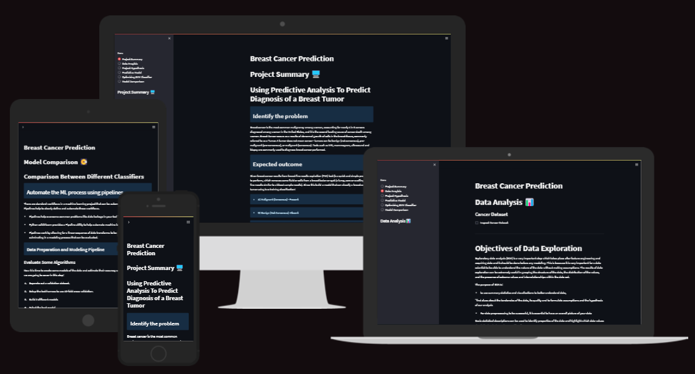

The dashboard for [Breast Cancer model is hosted on Heroku](https://breast-cancer-prediction.herokuapp.com/)

1.	Introdution
2.  Dataset Content
3.	Business Requirements
    *	Epics
    *	User Stories
4.	Hypotheses and validation
5.	Rationale to map the business requirements to the Data Visualizations and ML tasks
6.	ML Business Case
7.	Dashboard Design
    *	Page 1: Quick project summary
    *	Page 2: Data Anaylsis Page
    *	Page 3: Project Hypothesis
    *	Page 4: Predictive Model
    *	Page 5: Optimizing SVM Classifier
    *	Page 6: Model Comparison
8.	Unfixed Bugs
9.	Deployment
10.	Main Data Analysis and Machine Learning Libraries
11.	Credits

## Introduction

Breast cancer (BC) is one of the most common cancers among women worldwide, representing the majority of new cancer cases and cancer-related deaths according to global statistics, making it a significant public health problem in today’s society.

The early diagnosis of BC can improve the prognosis and chance of survival significantly, as it can promote timely clinical treatment to patients. Further accurate classification of benign tumors can prevent patients undergoing unnecessary treatments. Thus, the correct diagnosis of BC and classification of patients into malignant or benign groups is the subject of much research. Because of its unique advantages in critical features detection from complex BC datasets, machine learning (ML) is widely recognized as the methodology of choice in BC pattern classification and forecast modelling.

Classification and data mining methods are an effective way to classify data. Especially in medical field, where those methods are widely used in diagnosis and analysis to make decisions.

Symptoms for specific types of cancer
According to the American Cancer Society (ACS)Trusted Source, the most common sign of breast cancer is a new lump or mass in the breast. People should become familiar with the typical look and feel of their breasts to detect any changes early on.

Breast cancer can develop in males and females, but due to differencesTrusted Source in breast tissue, the disease is much less common in males.

Below, we outline some early indications of breast cancer. We also describe the various types and treatment options. Finally, we look into some benign conditions people may mistake for breast cancer.

Benign breast conditions
Several benign breast conditions can cause symptoms that resemble those of cancer. Some of these issues require treatment, while others go away on their own.

Though these conditions are benign, they can cause:

discomfort or pain swelling lumps Some common benign breast conditions include:

Cysts: These are fluid-filled sacs that can form in many parts of the body, including the breasts.

Mastitis: This is inflammation (swelling) in the breast that is usually from an infection.

Hyperplasia: This is an overgrowth of cells, particularly in the milk ducts or lobules inside the breast.

Sclerosing adenosis: This is a condition in which lobules enlarge.

Intraductal papillomas: These are benign wart-like tumors that grow within the milk ducts of the breast.

Fibroadenoma: These are common breast tumors that develop when an overgrowth of fibrous or glandular tissue forms around a lobule.

Radial scar: Also called complex sclerosing lesions, these are a core of connective tissue that can resemble breast cancer on a mammogram.

Fat necrosis: This develops following an injury to fatty breast tissue, as can happen following surgery, radiation, or injury to the breast.

Phyllodes tumors: These are fast-growing but typically painless tumors that start in the connective tissue of the breast. Some can be cancerous.

## Dataset Content

* The dataset is on kaggel it is publicly available so it does not require a license to use, the data set contain 569 rows and 32 columns. Each row represents and person and the columns have differant signs or textures of tumours.

Data Types
Structured data is data which is a form of data which has a high degree or organization such as numerical or categorical data. Temperature, phone numbers, gender are examples of structured data.

Unstructured data is data in a form which doesn’t explicitly have structure we are used to. Examples of unstructured data are photos, images, audio, language text and many others. There is an emerging field called Deep Learning which is using a specialized set of algorithms which perform well with unstructured data.

 The two common types of structured we commonly deal with are categorical variables (which have a finite set of values) or numerical values (which are continuous).

Categorical Variables: Categorical variables can also be nominal or ordinal.

    •	Nominal data has no intrinsic ordering to the categories. For example gender (Male, Female, Other) has no specific ordering.
    •	Ordinal data as clear ordering such as three settings on a toaster (high medium and low). A frequency table (count of each category) is the common statistic for describing categorical data of each variable, and a bar chart or a waffle chart (shown below) are two visualizations which can be used.

Numeric Variables: Numeric or continuous variables can be any value within a finite or infinite interval (temperature, height, weight.
    There are two types of numeric variables are interval and ratios.
    •	Interval variables have numeric scales and the same interpretation throughout the scale, but do not have an absolute zero. eg temperature in Fahrenheit or Celcius can meaningfully be subtracted or added (difference between 10 degrees and 20 degrees is the same difference as 40 to 50 degrees) but cannot be multiplied. For example, a day which is twice as hot may not be twice the temperature
    •	ratio scale of measurement is the most informative scale. It is an interval scale with the additional property that its zero position indicates the absence of the quantity being measured.

Transforming Data: There are a couple of techniques:
    •	Binning (Numerical to Categorical) -Binning
    •	Encoding (Categorical to Numerical); Continuization
    o	Encoding or continuation is the transformation of categorical variables to binary or numerical counterparts. An example is to treat male or female for gender as 1 or 0. Categorical variables must be encoded in many modeling methods (e.g., linear regression, SVM, neural networks)
    o	Two main types of encoding are Binary and Target-based (<http://www.saedsayad.com/encoding.htm>)
    o	Binary encoding is a special case of encoding where the value is set to a 0 or 1 to indicate absence or presence of a category.
    o	One hot encoding is a special case where multiple categories are each binary encoded. Given we have k categories, this will create k extra features (thus increasing the dimensionality of the data)

## Business Requirements

Business Requirement 1

*	The client is interested conducting a study to differentiate weather a tumor is benign or malignant.

Business Requirement 2

*	The client is interested in predicting whether a given tumour is malignant or benign based on the given features, with a high degree of accuracy.

### Epics

    •	Information gathering and data collection.
    •	Data visualization, cleaning, and preparation.
    •	Model training, optimization and validation.
    •	Dashboard planning, designing, and development.
    •	Dashboard deployment and release.

### User Stoires

    •	US1: As a client, I want to know which attributes will help to differentiate weather a tumor is benign or malignant on the the right set of features.
    
    •	US2: As a client, I want to have reliable prediction weather a tumor is bengin or maglignant helping to get the person the correct treament as quickly as possiable.

    •	US3: As a technical user, I want to learn about the ML steps that were used to arrive at the best prediction so that I can understand the model employed.
    
    •	US4: As a technical user, I want to know the model performance so that I can ensure that the predictions are reliable. 
    
    •	US5: As a client, I want to get a dashboard so that I can display the results of the prediction on a standalone app.
    
    •	US6: As a user, I want to have access to the data cleaning and preparation pipeline so that I can quickly detemine if the tumor is maglingant or begnian without reinventing the wheel.
    
    •	US7: As a user, I want to know the source and content of the data used in training the model so that I can be confident about the quality of the trained model.
    
    •	US8: As a user, I want to know the project hypotheses and how they were validated so that I get a deeper understand of the mechanisms that determine if a tumor is maglignant or begnian.

## Hypothesis and how to validate?

* We believe that by looking at different features we can with a good degree of accuracy differentiate between benign or malignant tumours. For this model, we would need the accuracy to be above 90% as stated in the business requirements.

* This analysis aims to observe which features are most helpful in predicting malignant or benign cancer and to see general trends that may aid us in model selection and hyperparameter selection. The goal is to classify whether the breast cancer is benign or malignant. To achieve this, I have used machine learning classification methods to fit a function that can predict the discrete class of new input.

## The rationale to map the business requirements to the Data Visualizations and ML tasks

Business Requirement 1: Data Visualizations
1. Data Exploration
2. Categorical Data
3. Feature Scaling

Business Requirement 2: Machine Learing Classification Analysis
1. Model Selection
2. Finalize Model
3. Test Model
4. Conclusion

## ML Business Case

This analysis aims to observe which features are most helpful in predicting malignant or benign cancer and to see general trends that may aid us in model selection and hyper parameter selection. The goal is to classify whether the breast cancer is benign or malignant. To achieve this i have used machine learning classification methods to fit a function that can predict the discrete class of new input. 
In our dataset we have the outcome variable or Dependent variable i.e Y having only two set of values, either M (Malign) or B(Benign). So we will use Classification algorithm of supervised learning.

We have different types of classification algorithms we will be using :-
1. Logistic Regression
2. Nearest Neighbor
3. Support Vector Machines
4. Decision Tree Algorithm
5. Random Forest Classification
We will use sklearn library to import all the methods of classification algorithms.
We will use LogisticRegression method of model selection to use Logistic Regression Algorithm.

The model success metrics are 90% or above on the test set.

To achieve this we will follow the CRISP DM process shown in the diagram below

## Dashboard Design

Page 1: Quick project summary
* Quick project summary
* Project Terms & Jargon
* Describe Project Dataset
* State Business Requirements

Page 2: Data Visualization
* Data Exploration
* Categorical Data
* Feature Scaling
Explore the variables to assess how they relate to the response variable In this notebook, we'll get familiar with the data using data exploration and visualization techniques using python libraries (Pandas, matplotlib, seaborn. Familiarity with the data is important which will provide useful knowledge for data pre-processing). Find the most predictive features of the data and filter it so it will enhance the predictive power of the analytics model. We'll use feature selection to reduce high-dimension data, feature extraction and transformation for dimensionality reduction. This is essential in preparing the data before predictive models are developed.

Page 3: Hypothesis
* Project Hypothesis
* Expected outcome

Page 4: Predictive Model
* Model Selection
* Test Model
Construct predictive models to predict the diagnosis of a breast tumor. We'll construct a predictive model using SVM machine learning algorithm to predict the diagnosis of a breast tumor. The diagnosis of a breast tumor is a binary variable (benign or malignant). we'll also evaluate the model using confusion matrix the receiver operating curves (ROC), which are essential in assessing and interpreting the fitted model.

Page 5 Optimizing Classifier
* Optimizing the SVM Classifier
* Grid Search Parameter Tuning
* Random Search Parameter Tuning
Construct predictive models to predict the diagnosis of a breast tumor. We'll aim to tune parameters of the SVM Classification model using scikit-learn.

Page 6: Model Comparison/Conculsion
* Evaluate Algorithms
* Tuning Hyper-Parameters
* Finalize Model
* Conclusion
There are standard workflows in a machine learning project that can be automated. In Python scikit-learn, Pipelines help to clearly define and automate these workflows.
* Pipelines help overcome common problems like data leakage in your test harness. 
* Python scikit-learn provides a Pipeline utility to help automate machine learning workflows.
* Pipelines work by allowing for a linear sequence of data transforms to be chained together culminating in a modeling process that can be evaluated.

## Fixed Bugs
* heroku deployment
* data loading with an index column 
  
## Unfixed Bugs
* There were no known unfixed bugs in this project.

## Deployment
### Heroku

* The App live link is: https://YOUR_APP_NAME.herokuapp.com/ 
* Set the runtime.txt Python version to a [Heroku-20](https://devcenter.heroku.com/articles/python-support#supported-runtimes) stack currently supported version.
* The project was deployed to Heroku using the following steps.

1. Log in to Heroku and create an App
2. At the Deploy tab, select GitHub as the deployment method.
3. Select your repository name and click Search. Once it is found, click Connect.
4. Select the branch you want to deploy, then click Deploy Branch.
5. The deployment process should happen smoothly if all deployment files are fully functional. Click now the button Open App on the top of the page to access your App.
6. If the slug size is too large then add large files not required for the app to the .slugignore file.

## Gitpod Reminders

To log into the Heroku toolbelt CLI:

1. Log in to your Heroku account and go to *Account Settings* in the menu under your avatar.
2. Scroll down to the *API Key* and click *Reveal*
3. Copy the key
4. In Gitpod, from the terminal, run `heroku_config`
5. Paste in your API key when asked

You can now use the `heroku` CLI program - try running `heroku apps` to confirm it works. This API key is unique and private to you so do not share it. If you accidentally make it public then you can create a new one with *Regenerate API Key*.

## Credits

### Main Languages Used

- [Jupyter Notebooks](https://en.wikipedia.org/wiki/Project_Jupyter#Jupyter_Notebook "Link to Jupyter Notebooks Wiki")
- [Python](https://en.wikipedia.org/wiki/Python_(programming_language) "Link to Python Wiki")

## Main Data Analysis and Machine Learning Libraries

* NumPy - Processing of images via conversion to NumPy arrays. Many other libraries used in this project are also dependent on NumPy
* Pandas - Conversion of numerical data into DataFrames to facilitate functional operations
* Matplotlib - Reading, processing, and displaying image data, producing graphs of tabular data
* Seaborn - Data visualisation and presentation, such as the confusion matrix heatmap and image dimensions scatter plot.
* Plotly - Graphical visualisation of data, used in particular on dashboard for interactive charts
* Scikit-learn - Calculating class weights to handle target imbalance and generating classification report
* Scikit-image - Application of Sobel filters to image averages to detect edges and dominant features

## Other technologies used

Streamlit - Development of dashboard for presentation of data and project delivery
Heroku - Deployment of dashboard as web application
Git/GitHub - Version control and storage of source code
CodeAnywhere - IDE Workspace in which application was developed

## Acknowledgements

- I would like to thank my family for their valued opinions and critic during the process of design and development.
- I would like to thank my tutor Seun, for their invaluable help and guidance throughout the process.
- Lastly, I would like to extend my deepest gratitude to the amazing people in Slack who helped me rigorously test every aspect of my site.

